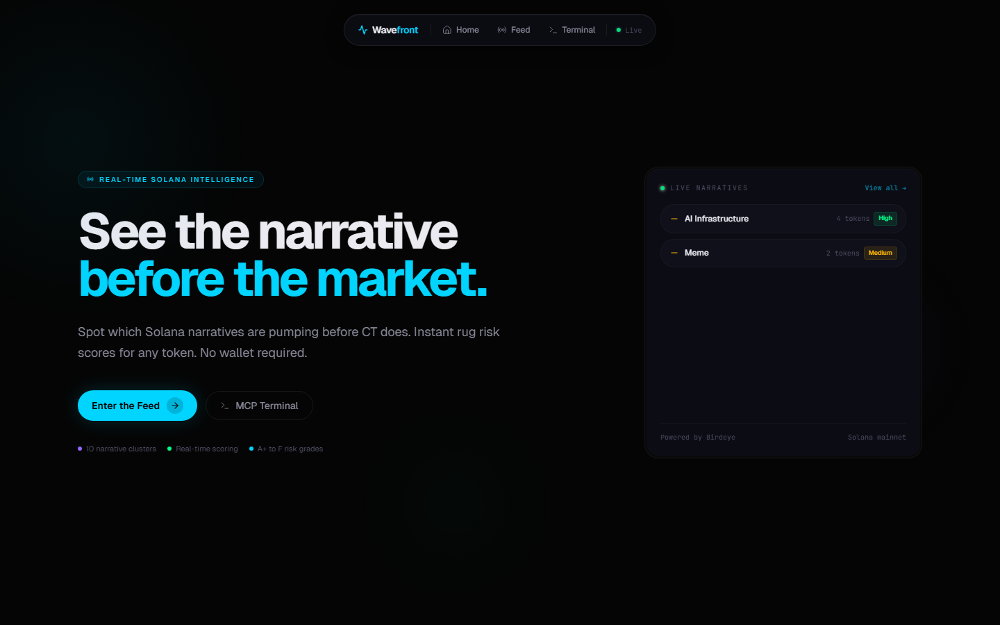
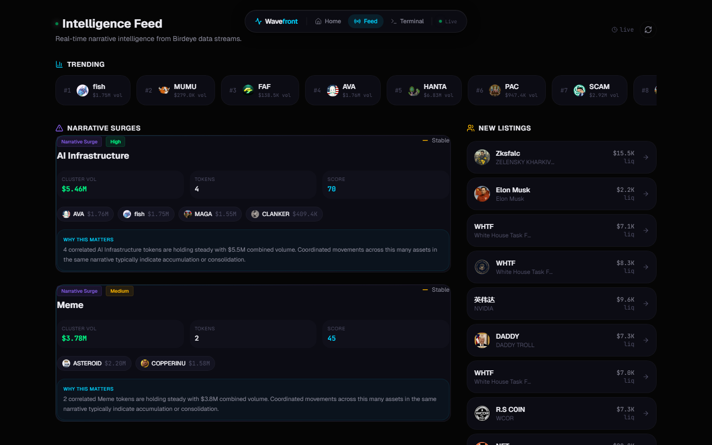
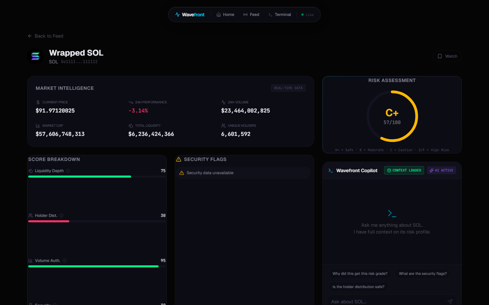
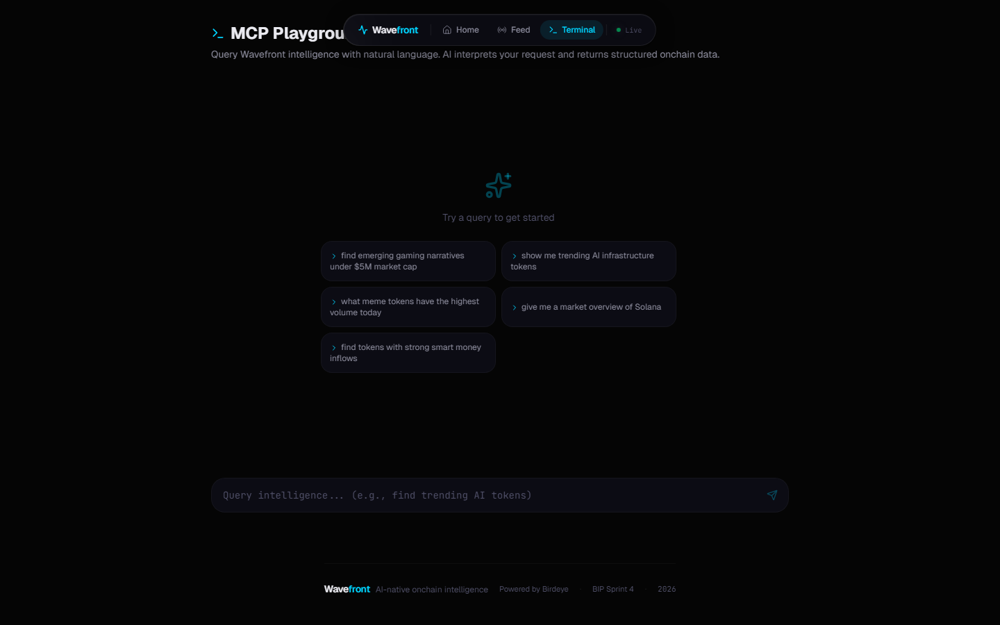
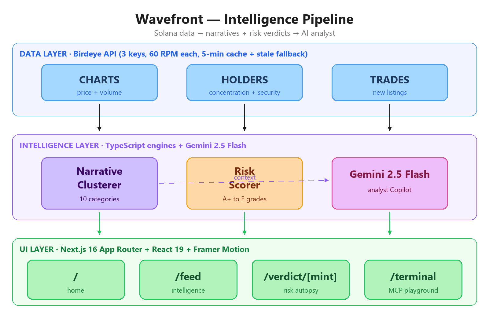

# Wavefront: I Got Tired of Solana Dashboards Lying to Me, So I Built an Onchain Analyst

> A long read on Wavefront — an AI-native intelligence terminal for Solana, built for the Birdeye Data BIP Competition.

---

## The 30-second pitch

By the time a token shows up on a "trending" list, the smart money is already out. Trending is a lagging indicator dressed up as a leading one. Every Solana market dashboard I've used hands me the same wall of green-and-red tickers and asks me to do the analyst's job — cross-reference holder concentration, scan freeze-authority flags, eyeball volume-to-liquidity ratios, sanity-check the mint metadata — across thirty open tabs. That isn't a product. That's homework.

**Wavefront** is the dashboard I wanted instead. It reads Birdeye's raw market data, clusters what is actually moving into human-readable *narratives*, mathematically grades every token on a four-axis risk rubric (A+ to F), and routes the full picture into a Gemini-powered analyst that you can ask follow-up questions. Less ticker tape. More signal.

Live demo: **[wavefront-gray.vercel.app](https://wavefront-gray.vercel.app)** · Code: **[github.com/Ghostiemoh/wavefront](https://github.com/Ghostiemoh/wavefront)**

---

## The problem with "trending"

Crypto Twitter has trained an entire generation of traders to chase moving averages of attention. The flow is well-rehearsed: a token's chart spikes, an influencer screenshots it, it lands on a trending feed, retail piles in, the original holders unload. By the time the dashboard *agrees* that something is moving, the move is over.

The dashboards aren't innocent here. Most of them sort tokens by 24-hour volume — a metric that wash traders manipulate trivially, since you can roundtrip the same dollar through your own wallets and inflate it indefinitely. They also have no concept of *meaning*. A list that puts a freezable, zero-liquidity scam in the same column as Jito is technically correct but practically useless. You're being asked to be your own analyst with a microscope and no labels.

Wavefront's bet is that the bottleneck isn't more data — Birdeye already exposes more than any one person can read. The bottleneck is *structure*. Cluster the tokens that are moving for the same reason. Penalize the ones that fail basic safety checks before they ever reach your screen. Hand the survivors to an analyst who never sleeps.

---

## Enter Wavefront

Three pillars hold the product up:

1. **Narrative Clustering** — Wavefront classifies every trending, meme, and smart-money token into one of ten narrative buckets (AI Infrastructure, Gaming, DeFi, Meme, RWA, DePIN, Social, Infrastructure, Payments, NFT), then ranks the buckets by cluster-wide volume velocity. You see *what theme is heating up* before the theme has a name on CT.
2. **Risk Scoring** — Every token gets a composite grade from A+ to F, computed from four weighted dimensions: liquidity depth, holder concentration, security flags, and volume authenticity. Zero-liquidity tokens are penalized into oblivion; wash-traded volume gets caught by ratio analysis. Scams cannot wear the same green badge as real assets.
3. **AI Copilot** — Open any token verdict and a Gemini 2.5 Flash analyst loads beside it, *pre-fed* the full risk profile, market snapshot, and security flags. Ask it "is this a honeypot?" and it answers using the actual numbers, not the training data.

The product lives on four routes: `/` (home with the live narrative ticker), `/feed` (the intelligence feed), `/verdict/[mint]` (per-token autopsy), and `/terminal` (a natural-language playground for AI agents).

---

## A guided tour

### Home — the wave you're surfing

The landing page does one job: tell you, in a glance, what narrative is moving *right now*. The hero pulls cached narrative data on the server, animates the orbs (cyan, violet, emerald — GPU-promoted via CSS so they paint once and stay cheap), and feeds the top three clusters into the live ticker. It's the closest a market dashboard gets to ambient awareness.

### `/feed` — the intelligence feed

The feed page is the working surface. Three rails:

- **Narrative cards** — each card is a cluster: category, velocity (slow / steady / fast / breakout), volume change percentage, and the top correlated tokens carrying the narrative. Click through to drill into any constituent.
- **Trending strip** — a tight horizontal scroll of the highest-volume tokens, deliberately small so it doesn't dominate the eye.
- **New listings rail** — fresh mints from the TRADES lane, filtered through the risk scorer so 99% of the pump-and-dump noise never reaches you.

The whole page auto-refreshes every 30 seconds. Stale data is invisible.

### `/verdict/[mint]` — the autopsy

This is the page I'm proudest of. Paste any Solana mint and Wavefront builds the full health report:

- An animated **risk gauge** (a circular SVG with a Framer-Motion spring tween at `[0.34, 1.56, 0.64, 1]` — the slight overshoot makes the grade *land* instead of slide in).
- Four **score bars** for the four dimensions, color-coded.
- **Market stats** — price, 24h change, volume, market cap, liquidity, holder count.
- **Security flags** — freeze authority, mutable metadata, Token-2022 status, liquidity lock percentage.
- **Watchlist toggle** — local storage; one click to follow.

On the same surface, an F-grade scam tells you everything in one glance — zero liquidity, freeze authority active, top-10 holding >90%, the gauge red before you finish reading. Same template, different verdict, no analyst's eye required.

### The Copilot

The Copilot sits beside the verdict (visible on the right of the screenshot above). It is not a generic chatbot. Every conversation is bootstrapped with the actual risk grade, the actual flags, the actual liquidity number — fed into Gemini's system prompt as Bloomberg-terminal-style context. Ask it *should I buy this?* and you get a three-sentence verdict that references the data, not platitudes. (Gemini is also instructed, in the prompt, to drop the disclaimers — see [`lib/ai/gemini.ts`](https://github.com/Ghostiemoh/wavefront/blob/main/lib/ai/gemini.ts) for the exact system prompts.)

### `/terminal` — the agent playground

The terminal route is a natural-language interface for AI agents. Type "show me AI infrastructure tokens under $10M market cap with high volume," and Gemini parses the query into structured filters (`intent`, `narrative`, `maxMarketCap`, `minVolume`, `sortBy`) before the search runs. It is the wire format an MCP agent would hit if you wanted to plug Wavefront into Claude or Cursor.

---

## Under the hood

Three layers, drawn:

> Interactive version: [view on Excalidraw](https://excalidraw.com/#json=4qSmdrEEZQ3wZSnqUKWcp,hiFATBhvgDDkxI0LdjN6Yg)

### 1. The narrative clustering engine

The narrative clusterer is dumber than it looks, and that's the point. It fetches three Birdeye endpoints in parallel — trending, meme, and smart-money tokens — deduplicates by mint address, then classifies each token by keyword-matching its name and symbol against a curated dictionary of ten categories. "GPT", "neural", "agent" → AI Infrastructure. "depin", "iot", "hotspot" → DePIN. "doge", "shib", "frog" → Meme. The full keyword map lives in [`lib/intelligence/narrative-clusterer.ts`](https://github.com/Ghostiemoh/wavefront/blob/main/lib/intelligence/narrative-clusterer.ts).

Once tokens are classified, clusters are ranked by *velocity* — the average 24-hour volume change across the cluster, not the absolute volume. A narrative with five small tokens each up 200% is hotter than one big token grinding sideways. Gemini gets the cluster summary as input and writes a two-sentence trader-language headline ("rotation into DePIN as DePIN-Bandwidth leads with +180% volume…"), with a deterministic fallback if the model is unavailable.

Keyword matching has obvious limits. A token literally named "TURBO" doesn't get caught by any of my keywords; a token named "PEPE AI" gets classified as Meme because the meme matcher fires before the AI matcher. The next iteration moves to embedding-based clustering, but the cheap version ships *today* and is right often enough to be useful.

### 2. The risk scoring engine

The scoring engine is where opinions become math. Every verdict is a weighted sum of four sub-scores:

| Dimension | Weight | Signal |
|---|---|---|
| Liquidity | 30% | Depth, volume-to-liquidity ratio, MC-to-liquidity ratio |
| Holder concentration | 25% | Top-10 holder %, creator %, owner % |
| Security flags | 25% | Freeze authority, mutable metadata, transfer fee, lock % |
| Volume authenticity | 20% | Wash-trade ratio, unique wallet count |

The thresholds are aggressive on purpose. Liquidity under $100? The liquidity sub-score is zero, full stop — anything below that depth is unsellable. Top-10 holders own >70%? Knock 20 points off the holder score. Volume-to-liquidity ratio above 10×? That's wash-trading territory; the volume score takes a 15-point hit. Liquidity locked above 80%? Bonus 20 points. The full source — every magic number, every flag string — lives in [`lib/intelligence/risk-scorer.ts`](https://github.com/Ghostiemoh/wavefront/blob/main/lib/intelligence/risk-scorer.ts).

A score of 90+ is A+. Below 25 is F. The grade is the headline; the four sub-scores are the receipts.

### 3. The three-lane Birdeye client

Birdeye rate-limits at 60 RPM per key. One key is not enough to run the home page, the feed, and a verdict drill-down concurrently without a queue forming. So Wavefront ships with three keys, each pinned to a "lane" — CHARTS (price + volume), HOLDERS (concentration + security), TRADES (new listings). Every request gets throttled per-lane with a 1.5-second floor and cached for five minutes. On a 429, it falls back to CHARTS; on any failure, it serves stale cache rather than crash. Code: [`lib/birdeye/client.ts`](https://github.com/Ghostiemoh/wavefront/blob/main/lib/birdeye/client.ts).

It's unglamorous infrastructure that makes the rest of the product feel instant.

---

## Design philosophy — the Antigravity stack

I have a rule for everything I ship: no generic AI patterns, no placeholders, no "in today's fast-paced world." If the interface looks like ChatGPT shipped it, I rewrite it.

Wavefront is dark-mode only, because the people staring at risk verdicts at 3 a.m. don't need a white screen. The depth is glassmorphism — translucent panels stacked on top of three GPU-promoted color orbs (cyan, violet, emerald) that paint once on page load and never repaint. Motion is Framer Motion springs with a slight overshoot ease (`[0.34, 1.56, 0.64, 1]`); the risk gauge doesn't slide to its grade, it *lands* on it.

Typography is monospace where data lives (charts, addresses, scores) and a clean sans for narrative copy. Every interactable element has `cursor: pointer` — non-negotiable. The grid is asymmetric on purpose; symmetric dashboards put every cell on equal footing and force the eye to scan. Wavefront's grid argues for itself about where to look.

---

## Tech stack

| Layer | Choice |
|---|---|
| Framework | Next.js 16 (App Router) |
| Runtime | React 19 |
| Language | TypeScript 5 |
| Styling | Tailwind CSS v4 |
| Animation | Framer Motion 12 |
| AI | Google Gemini 2.5 Flash |
| Data | Birdeye Public API |
| Charts | Recharts 3 |
| Icons | Lucide |
| Deploy | Vercel |

---

## What's next

The hackathon submission is the floor, not the ceiling. The next four things on the roadmap, in order:

1. **Wallet-aware feeds** — connect your wallet, get narratives weighted by your holdings.
2. **Narrative backtesting** — let users replay any narrative window and see what they would have made by buying the top-3 carriers when the cluster first lit up.
3. **Telegram alerts** — push a notification the moment a new narrative crosses the breakout threshold.
4. **Onchain provenance** — pipe Helius webhooks into the new-listings rail so risk verdicts are generated within seconds of a mint, not the next refresh tick.

Embedding-based narrative classification (instead of keyword matching) is in the same pile but blocked on cost — running embeddings against every trending refresh is not free, and the keyword version is good enough to ship.

---

## Try it

- **Live demo** → [wavefront-gray.vercel.app](https://wavefront-gray.vercel.app)
- **Source** → [github.com/Ghostiemoh/wavefront](https://github.com/Ghostiemoh/wavefront)
- **Architecture diagram (interactive)** → [Excalidraw](https://excalidraw.com/#json=4qSmdrEEZQ3wZSnqUKWcp,hiFATBhvgDDkxI0LdjN6Yg)
- **Built for** the [Birdeye Data BIP Competition](https://birdeye.so)

Built by [Muhammad Auwal Abdulaziz (@Ghostiemoh)](https://github.com/Ghostiemoh) — onchain analyst, mathematics graduate, full-time Solana builder. If you want to argue with the risk weights or the narrative buckets, the issues tab is open.
